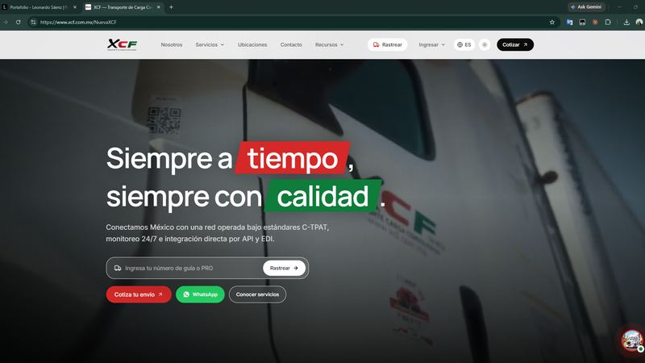
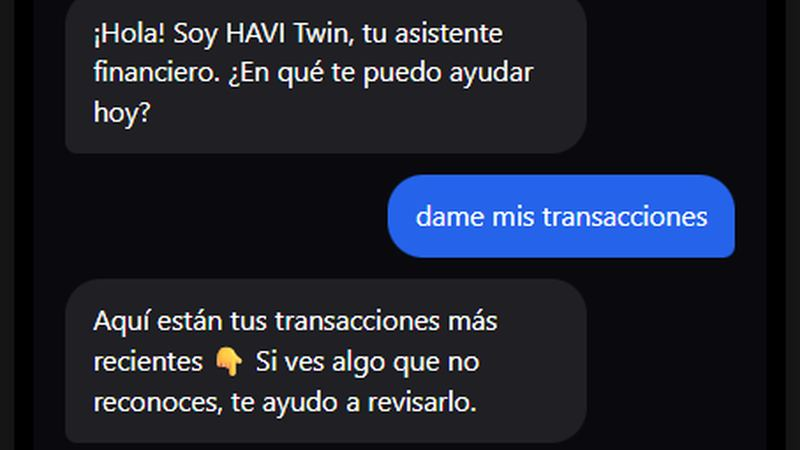
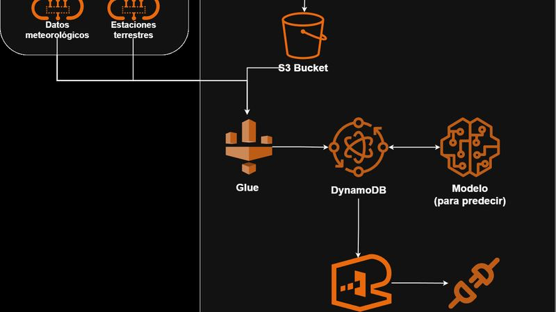
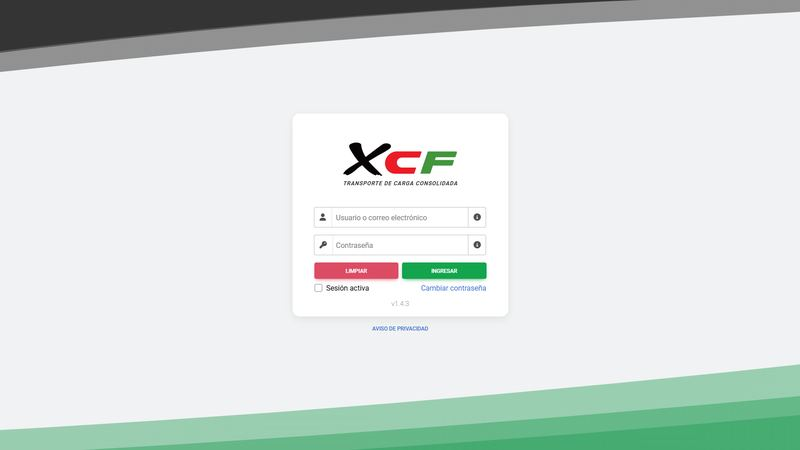
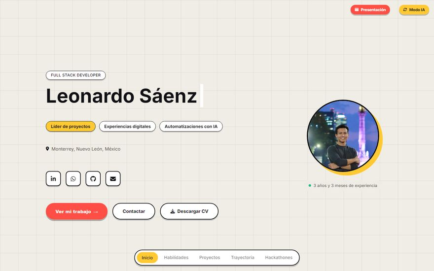
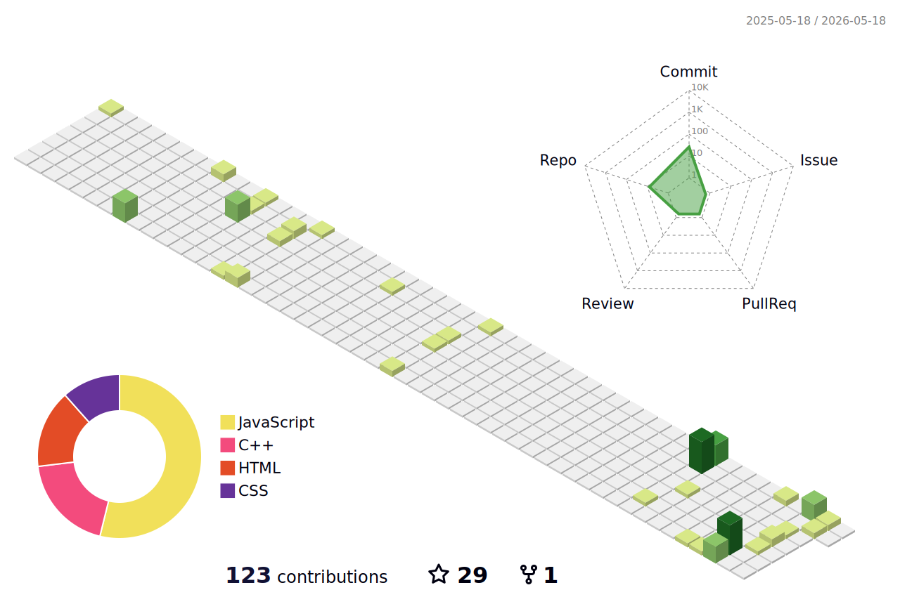

<div align="center">

<picture>
  <source media="(prefers-color-scheme: dark)" srcset="assets/hero-dark.svg">
  
</picture>

<picture>
  <source media="(prefers-color-scheme: dark)" srcset="https://readme-typing-svg.demolab.com?font=JetBrains+Mono&weight=500&size=20&duration=2600&pause=900&color=FFFFFF&center=true&vCenter=true&width=720&lines=Building+AI+agents+that+actually+ship+to+production;ERP+systems+%C2%B7+Agentic+web+apps+%C2%B7+ML+pipelines;.NET+%C2%B7+Next.js+%C2%B7+Python+%C2%B7+n8n+%C2%B7+LangChain+%C2%B7+AWS;Monterrey%2C+M%C3%A9xico+%F0%9F%87%B2%F0%9F%87%BD">
  
</picture>

<br>

<a href="https://leonardosaenz.com.mx/portafolio"></a>
<a href="https://www.linkedin.com/in/leonardos4enz/"></a>
<a href="mailto:leonardorsaenz@gmail.com"></a>


</div>

<br>

## `$ whoami`

**Full Stack Developer & AI Project Lead** — Computer Science graduate (UANL FCFM). I lead dev teams and build systems end-to-end: corporate web platforms, a full ERP, and AI agents that don't just chat — they **operate the UI, query databases with guardrails, and run in production**.

- 🤖 **Currently:** AI Lead @ XCF — agentic assistants with n8n, RAG pipelines with pgvector, voice agents with ElevenLabs/RetellAI
- 🧠 **Obsessed with:** agents that take real actions — tool-calling, generative UI, autonomous ML pipelines
- 🏆 **MLH prize winner** at NASA International Space Apps Challenge 2025
- 📍 Monterrey, Nuevo León, México · Open to interesting projects

<br>

## `$ ls ~/hackathons`

<div align="center">

</div>

- 🏆 **NASA International Space Apps Challenge 2025** — MLH prize: *Best Use of ElevenLabs*, with **A.E.R.I.S.** (AI + ML + NASA TEMPO satellite data)
- 🔟 **Datathon DSC 2026 (HeyBanco)** — Top 10 of 60+ teams with **HeyTwin**, team *Specters*

<br>

## `$ cat ~/stack`

<div align="center">
<picture>
  <source media="(prefers-color-scheme: dark)" srcset="assets/stack-dark.svg">
  
</picture>
</div>

<br>

## `$ ls ~/featured-builds`

| Project | What it does | Stack |
|---|---|---|
| **[XCF 2026](https://www.xcf.com.mx/)** ⭐ | Corporate site with an **agentic AI assistant** that navigates the page and operates components (shipment tracking, quotes) on the user's behalf. Live map, i18n, dark mode. | `Next.js` `TypeScript` `.NET 10` `SQL Server` `n8n` |
| **[HeyTwin](https://github.com/leonardos4enz/Datathon-2026-Specters)** | Digital twin of 15,025 bank customers — HDBSCAN finds 6 real segments, Random Forest + Optuna predicts profiles in <50 ms, an LLM agent answers with live generative charts. **Top 10 of 60+ teams**, Datathon DSC 2026. | `Python` `FastAPI` `pgvector` `LangChain` `AWS` |
| **A.E.R.I.S.** | AI agent predicting air quality in real time from NASA TEMPO satellite data, with voice alerts for at-risk people. **🏆 MLH: Best Use of ElevenLabs**, NASA Space Apps 2025. | `Python` `AWS Lambda` `DynamoDB` `ML` `ElevenLabs` |
| **[XSLAYCC ERP](https://www.xcf.com.mx/xslaycc)** | Full ERP: purchasing, inventory & fleet management. 3-tier architecture (WEB / API / CLASSES) with AES-encrypted transport. Led the dev team with SCRUM. | `.NET 8` `C#` `SQL Server` `Azure DevOps` `IIS` |

<div align="center">
<table>
  <tr>
    <td align="center" width="50%">
      <a href="https://www.xcf.com.mx/"></a>
      <sub><b>XCF 2026</b> — agentic assistant operating the UI</sub>
    </td>
    <td align="center" width="50%">
      <a href="https://github.com/leonardos4enz/Datathon-2026-Specters"></a>
      <sub><b>HeyTwin</b> — generative UI over 15k customer profiles</sub>
    </td>
  </tr>
  <tr>
    <td align="center" width="50%">
      
      <sub><b>A.E.R.I.S.</b> — air-quality prediction from NASA TEMPO</sub>
    </td>
    <td align="center" width="50%">
      <a href="https://www.xcf.com.mx/xslaycc"></a>
      <sub><b>XSLAYCC</b> — ERP running XCF's daily operations</sub>
    </td>
  </tr>
</table>
</div>

<br>

## `$ open leonardosaenz.com.mx`

My portfolio is a product in itself: a neo-brutalist site with an **AI mode** — an agentic assistant (n8n + RAG on pgvector) that answers questions about me, navigates the site for you, and can even email me from the chat.

<div align="center">
<a href="https://leonardosaenz.com.mx/portafolio"></a>

<sub>👆 Click to visit — or try the <a href="https://leonardosaenz.com.mx/">AI mode</a> and talk to my digital twin</sub>

<br><br>


<sub>⚡ This badge is generated live by my own site — an ASP.NET endpoint serving animated SVG with real uptime</sub>
</div>

<br>

## `$ htop --github`

<div align="center">

<picture>
  <source media="(prefers-color-scheme: dark)" srcset="https://github-readme-stats.vercel.app/api?username=leonardos4enz&show_icons=true&theme=transparent&hide_border=true&title_color=FFFFFF&text_color=8A8A8A&icon_color=FFFFFF&ring_color=FFFFFF&rank_icon=github">
  
</picture>
<picture>
  <source media="(prefers-color-scheme: dark)" srcset="https://github-readme-stats.vercel.app/api/top-langs/?username=leonardos4enz&layout=compact&theme=transparent&hide_border=true&title_color=FFFFFF&text_color=8A8A8A&langs_count=8">
  
</picture>

<picture>
  <source media="(prefers-color-scheme: dark)" srcset="https://streak-stats.demolab.com?user=leonardos4enz&hide_border=true&background=00000000&ring=FFFFFF&fire=FFFFFF&currStreakNum=FFFFFF&sideNums=FFFFFF&currStreakLabel=8A8A8A&sideLabels=8A8A8A&dates=555555&stroke=8A8A8A">
  
</picture>

<picture>
  <source media="(prefers-color-scheme: dark)" srcset="https://github-readme-activity-graph.vercel.app/graph?username=leonardos4enz&bg_color=00000000&hide_border=true&color=8A8A8A&line=FFFFFF&point=FFFFFF&area=true&area_color=FFFFFF">
  
</picture>

<picture>
  <source media="(prefers-color-scheme: dark)" srcset="profile-3d-contrib/profile-night-green.svg">
  
</picture>

<picture>
  <source media="(prefers-color-scheme: dark)" srcset="https://raw.githubusercontent.com/leonardos4enz/leonardos4enz/output/github-snake-dark.svg">
  
</picture>

</div>

<br>

<div align="center">

```csharp
while (alive) { Build(); Learn(); Ship(); }
```

<sub>© Leonardo Sáenz · Monterrey, MX · handle is <b>leonardos4enz</b> — with a 4 😉</sub>

</div>
