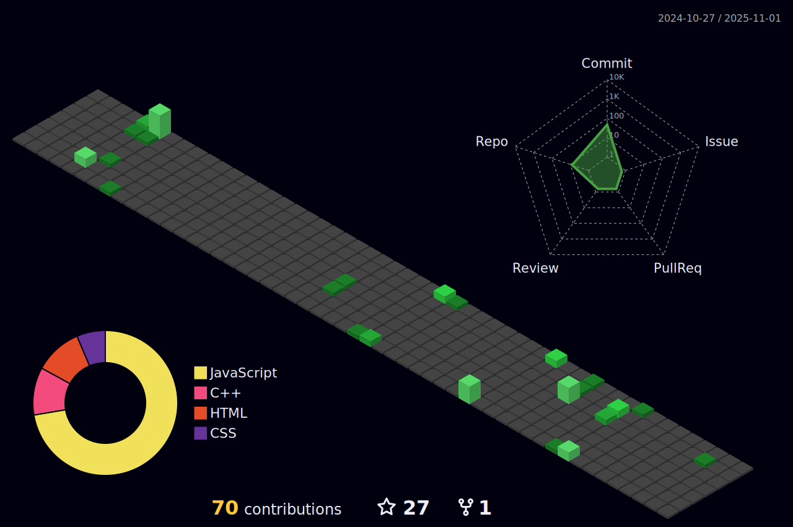

<!-- [Botones Geniales]           c njhkh   -->
<div align="center">           
  <p>
    <!-- [Repositorios] -->
    <a href="https://github.com/leonardos4enz?tab=repositories&sort=stargazers">
      
    </a>
    <!-- [Chat Discord] -->
    <a href="https://discord.gg/6y9mrdCTNJ">
      
    </a>
    <!-- [Estrellas Totales en Repositorios] -->
    <a href="https://github.com/leonardos4enz?tab=repositories&sort=stargazers">
      
    </a>
    <!-- [Followers] -->
    <a href="https://github.com/leonardos4enz?tab=followers">
      
    </a>
  </p>
</div>

<!-- [Imagen Principal] -->
<div align="center"> 
  <a>
    
  </a>
</div>
<br>

<!-- [Botones de Redes Sociales] -->
<p align="center">
  <!-- [Discord] -->
  <a target="_blank" href="https://discord.gg/6y9mrdCTNJ" alt="Únete" title="Servidor de Discord">
    
  </a>
  &#8287;&#8287;&#8287;&#8287;&#8287;
  <!-- [Linkedin] -->
  <a target="_blank" href="https://linkedin.com/in/leonardos4enz">
    
  </a>
</p>

<!-- [Presentación de habilidades personales] -->
<div align="center"> 
  <!-- [Sistemas Web] -->
  <a>
    
  </a>
  <br>
  <!-- [Apps] -->
  <a>
    
  </a>
  <br>
  <!-- [Edición de contenido] -->
  <a>
    
  </a>
  <br>
</div>

<!-- [StackOverflow Stats] -->
<details>
  <summary align="left">
    <b> StackOverflow Stats</b>
  </summary> 
  <br/>
  <div align="center">
    
  [](https://stackoverflow.com/users/21209495/leonardo-sáenz)
  
  </div>
</details>
<div align="center">  

  

</div>

<!-- [Stats] -->
<details>
  <summary align="left">
    <b> Mis Stats</b>
  </summary> 
  <br/>
  <p align="left">
    <div align="center">  
      
      
      
    </div>
  </p>
</details>

<!-- [Contribuciones] -->
<details>
  <summary align="left">
     <b>Mis contribuciones</b>
  </summary>
  <br/>
  <p>
    <div align="center">
      
    </div> 
  </p>
</details>

<!-- [Trofeos] -->
<details>
  <summary align="left">
     <b>Mis trofeos de Github</b>
  </summary>
  <br/>
  <p>
    <div align="center"> 
    
  [](https://github.com/ryo-ma/github-profile-trophy)
    </div> 
  </p>
</details>

<details>
  <summary align="left">
     <b>Followers</b>
  </summary>
  <br />
  <p>
  <div align="center">
<!--START_SECTION:top-followers-->
<table>
  <tr>
    <td align="center">
      <a href="https://github.com/korizyx">
        
      </a>
      <br />
      <a href="https://github.com/korizyx">Kori</a>
    </td>
    <td align="center">
      <a href="https://github.com/6wki">
        
      </a>
      <br />
      <a href="https://github.com/6wki">Shawki</a>
    </td>
    <td align="center">
      <a href="https://github.com/hpenapp">
        
      </a>
      <br />
      <a href="https://github.com/hpenapp">Humberto  Peña</a>
    </td>
    <td align="center">
      <a href="https://github.com/Antagonist-no-name">
        
      </a>
      <br />
      <a href="https://github.com/Antagonist-no-name">Antagonist</a>
    </td>
    <td align="center">
      <a href="https://github.com/andresmontes3">
        
      </a>
      <br />
      <a href="https://github.com/andresmontes3">Andrés Montes</a>
    </td>
    <td align="center">
      <a href="https://github.com/bosieett">
        
      </a>
      <br />
      <a href="https://github.com/bosieett">Kevin Sánchez</a>
    </td>
    <td align="center">
      <a href="https://github.com/GermanxD">
        
      </a>
      <br />
      <a href="https://github.com/GermanxD">German Bustos Moreno</a>
    </td>
  </tr>
  <tr>
    <td align="center">
      <a href="https://github.com/sairammg">
        
      </a>
      <br />
      <a href="https://github.com/sairammg">Sairam Martínez Granados</a>
    </td>
    <td align="center">
      <a href="https://github.com/Pelusa29">
        
      </a>
      <br />
      <a href="https://github.com/Pelusa29">Ernesto</a>
    </td>
    <td align="center">
      <a href="https://github.com/Kevin-v-v">
        
      </a>
      <br />
      <a href="https://github.com/Kevin-v-v">Kevin Villalobos</a>
    </td>
    <td align="center">
      <a href="https://github.com/IngenieroTony">
        
      </a>
      <br />
      <a href="https://github.com/IngenieroTony">IngenieroTony</a>
    </td>
    <td align="center">
      <a href="https://github.com/EnriqueSVzz">
        
      </a>
      <br />
      <a href="https://github.com/EnriqueSVzz">Enrique S.Vázquez</a>
    </td>
    <td align="center">
      <a href="https://github.com/CesarDG10">
        
      </a>
      <br />
      <a href="https://github.com/CesarDG10">CesarDG10</a>
    </td>
  </tr>
</table>
<!--END_SECTION:top-followers-->
  <p align="center">
    <b>Visitantes 👽</b>
  </p>
  
</div>
    
 </p>
</details>

<!-- [쮻e dónde soy?] -->
<details>
  <summary align="left">
     <b>De donde soy</b>
  </summary>
  <br />
  <p>
  <div align="center"> 
   
   ```geojson
{
  "type": "FeatureCollection",
  "features": [
    {
      "type": "Feature",
      "id": 1,
      "properties": {
        "ID": 0
      },
      "geometry": {
        "type": "Polygon",
        "coordinates": [
          [
              [-100.3696822, 25.7246452, 0],
              [-100.3506278, 25.6240815, 0],
              [-100.2986144, 25.6330583, 0],
              [-100.2890013, 25.6454391, 0],
              [-100.2749251, 25.6370822, 0],
              [-100.2370738, 25.6425761, 0],
              [-100.2271175, 25.6561938, 0],
              [-100.2316664, 25.6909272, 0],
              [-100.2483176, 25.7017551, 0],
              [-100.2769851, 25.6985069, 0],
              [-100.2879714, 25.70655, 0],
              [-100.2932929, 25.7311403, 0],
              [-100.2855681, 25.7419645, 0],
              [-100.2502059, 25.7470671, 0],
              [-100.2529524, 25.7642285, 0],
              [-100.2924346, 25.7586629, 0],
              [-100.3124331, 25.7387174, 0],
              [-100.3025626, 25.6974241, 0],
              [-100.2836798, 25.683347, 0],
              [-100.2534675, 25.6856675, 0],
              [-100.2448844, 25.6797888, 0],
              [-100.2434251, 25.6730973, 0],
              [-100.2423952, 25.6665605, 0],
              [-100.2445839, 25.6629633, 0],
              [-100.2485751, 25.6588243, 0],
              [-100.2792173, 25.6547254, 0],
              [-100.289645, 25.6477217, 0],
              [-100.3023909, 25.6559617, 0],
              [-100.3305434, 25.65101, 0],
              [-100.3497695, 25.7521694, 0],
              [-100.4120826, 25.7400704, 0],
              [-100.3696822, 25.7246452, 0]   
          ]
        ]
      }
    }
  ]
}
   ```
    
  </div>
</details>


<!-- [Snake (Animación)]
<div align="center"> 
  
  
  
</div>
 -->


